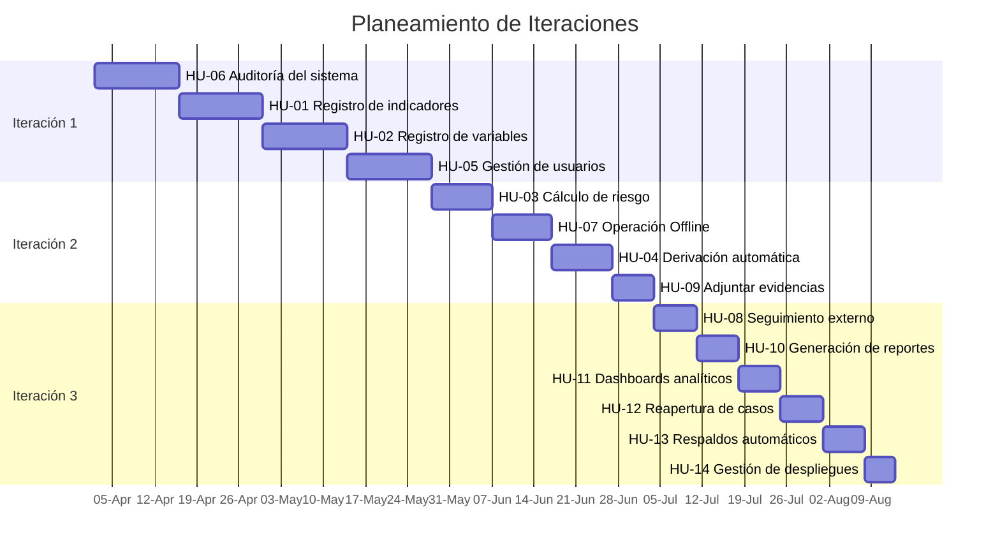

```mermaid
gantt
    title Planeamiento de Iteraciones
    dateFormat  YYYY-MM-DD
    axisFormat  %d-%b
    todayMarker off

    section Iteración 1
    HU-06 Auditoría del sistema               :a1, 2026-04-02, 14d
    HU-01 Registro de indicadores             :a2, 2026-04-16, 14d
    HU-02 Registro de variables               :a3, 2026-04-30, 14d
    HU-05 Gestión de usuarios                 :a4, 2026-05-14, 14d

    section Iteración 2
    HU-03 Cálculo de riesgo                   :b1, 2026-05-28, 10d
    HU-07 Operación Offline                   :b2, 2026-06-07, 10d
    HU-04 Derivación automática               :b3, 2026-06-17, 10d
    HU-09 Adjuntar evidencias                 :b4, 2026-06-27, 7d

    section Iteración 3
    HU-08 Seguimiento externo                 :c1, 2026-07-04, 7d
    HU-10 Generación de reportes              :c2, 2026-07-11, 7d
    HU-11 Dashboards analíticos               :c3, 2026-07-18, 7d
    HU-12 Reapertura de casos                 :c4, 2026-07-25, 7d
    HU-13 Respaldos automáticos               :c5, 2026-08-01, 7d
    HU-14 Gestión de despliegues              :c6, 2026-08-08, 5d
```